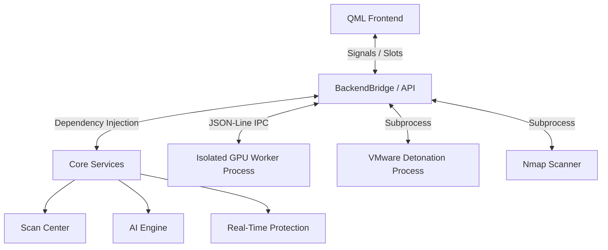

# Sentinel Architecture & System Design

Sentinel is engineered to handle intensive tasks—such as file scanning, malware detonation, and hardware polling—without freezing the graphical user interface. To achieve this, it relies on strict process isolation, event-driven inter-process communication (IPC), and explicit platform abstraction layers.

---

## 1. High-Level Architecture

The system is cleanly split between a declarative frontend (`PySide6` / `QML`) and a service-oriented backend (`Python 3.11+`).

---

## 2. Process Isolation & The Backend Bridge

GUI applications must never block the main thread. Sentinel enforces strict isolation for any workload that could hang or block (e.g., waiting for an API response, interrogating a faulty GPU driver, or scanning a multi-gigabyte file).

### The QML `BackendBridge`
All communication between the QML frontend and the Python backend flows through the `BackendBridge` class via Qt's Signals and Slots mechanism. QML triggers an action by invoking a `@Slot()`, and Python updates the UI by emitting a `Signal()`.

### Subprocess Workers & IPC
Sentinel utilizes `QProcess` and Python's `subprocess` / `multiprocessing` heavily. 
- **GPU Telemetry:** The `GPUServiceBridge` spawns a dedicated Python worker that continuously polls hardware sensors. It communicates back to the main process using a lightweight, newline-delimited JSON protocol.
- **Circuit Breaking:** The main process runs a 60-second heartbeat watchdog. If a hardware driver (like an AMD DRM node) hangs the worker process, the circuit breaker triggers, forcefully terminating the hung worker and gracefully updating the UI to `Unavailable` instead of crashing the entire application.

---

## 3. Platform Abstraction Layer

Sentinel operates cross-platform (Windows & Linux), but it refuses to use "lazy wrappers" that obscure the host OS's reality. Instead, it features dedicated platform implementations that are resolved at runtime.

### The `platform` Package
The `backend/platform/` directory houses OS-specific logic. The dependency injection container (`backend/core/container.py`) detects the host OS at startup and injects the correct concrete implementation.

- **Windows Integrations:**
  - `pywin32` for direct reading of the Windows Event Log.
  - `wmi` for subscribing to `Win32_Process.__InstanceCreation` events (Real-Time Protection).
- **Linux Integrations:**
  - `journalctl` parsing for system events.
  - Raw `sysfs` and `drm` node reading for AMD and Intel GPUs (avoiding massive ROCm dependencies).
  - Shell integrations to check `ufw`, `iptables`, `aa-status`, and `getenforce` for security posture.

---

## 4. Graceful Degradation Model

A core design philosophy of Sentinel is "Truthful Platform Boundaries." If an integration is missing, the application does not crash, nor does it silently swallow the error to display `0%` or blank data.

Instead, every metric and capability supports explicit status states:
- `ok`: Running normally.
- `unsupported`: The host OS or hardware fundamentally lacks this feature.
- `unavailable`: The feature exists but the required dependency (e.g., Nmap, ClamAV) is not in the PATH.
- `permission_denied`: The feature requires elevation (Root / UAC Admin).

This ensures that security analysts always know *why* a piece of telemetry is missing.

---

## 5. Storage and Data Persistence

Sentinel utilizes `SQLite3` in **WAL (Write-Ahead Logging)** mode to handle high-frequency concurrent writes from multiple processes (e.g., the Real-Time Protection engine logging events while the Scan Center logs a file hash).

- **Paths:** Adheres strictly to OS standards (`%APPDATA%` on Windows, `$XDG_DATA_HOME` on Linux).
- **Repositories:** Uses a Repository pattern (`history_repo.py`, `incident_repo.py`) to abstract SQL queries away from the business logic.
